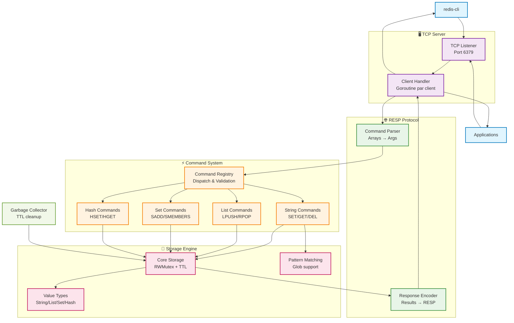

# Redis-Go
[](https://golang.org/)
[](https://docker.com/)
[](https://www.typescriptlang.org/)
> Implémentation Redis partielle en Go avec protocole RESP (REdis Serialization Protocol) et support des types de données courants.

## 👨‍💻 Équipe de développement
|   **Développeur**    | **Classe** |
|:--------------------:|:----------:|
| **ALLARD Alexandre** | **`5IW2`** |
|  **GRANDIN Victor**  | **`5IW2`** |
|  **NKUMBA Estelle**  | **`5IW2`** |

## Fonctionnalités

### Types de données
- **Strings** avec TTL (INCR/DECR)
- **Lists** bidirectionnelles avec PUSH/POP
- **Sets** pour collections uniques
- **Hashes** pour objets structurés

### Protocole / Implémentation
- **RESP complet** compatible Redis
- **Pattern matching** avancé pour KEYS
- **Garbage collection** automatique des TTL

---

## Démarrage rapide

### Docker (Compose)

#### Démarrage
```bash
git clone <repository-url> && cd redis-go
make run
make cli  # Dans un autre terminal
```

#### Rédémarrage rapide (avec build)
```bash
make restart
```

### Go natif
```bash
go mod tidy && go run main.go
redis-cli -p 6379  # Test
```

### Premier test
```bash
SET welcome "Coucou Redis en GO !!" EX 3600
GET welcome
ALAIDE  # Voir toutes les commandes
```

---

## Architecture

### Structure du projet
```
redis-go/
├── main.go                    # Point d'entrée
├── internal/
│   ├── config/               # Configuration serveur
│   ├── protocol/             # Parser/Encoder RESP
│   ├── commands/             # Handlers de commandes
│   ├── storage/              # Moteur de stockage
│   └── server/               # Serveur TCP + lifecycle
├── Dockerfile                # Image Docker
├── compose.yml
└── Makefile                 # Commandes dev
```

### Flux de données



---

## API des commandes

### Strings & Compteurs
| Commande | Syntaxe | Description |
|----------|---------|-------------|
| `SET` | `SET key value [EX seconds]` | Stocke avec TTL optionnel |
| `GET` | `GET key` | Récupère une valeur |
| `DEL` | `DEL key [key ...]` | Supprime des clés |
| `INCR` | `INCR key` | Incrémente de 1 |
| `INCRBY` | `INCRBY key increment` | Incrémente par N |

### Listes
| Commande | Syntaxe | Description |
|----------|---------|-------------|
| `LPUSH` | `LPUSH key element [element ...]` | Ajoute au début |
| `RPUSH` | `RPUSH key element [element ...]` | Ajoute à la fin |
| `LPOP` | `LPOP key` | Retire du début |
| `LLEN` | `LLEN key` | Longueur de liste |
| `LRANGE` | `LRANGE key start stop` | Sous-ensemble |

### Sets & Hashes
| Commande | Syntaxe | Description |
|----------|---------|-------------|
| `SADD` | `SADD key member [member ...]` | Ajoute des membres |
| `SMEMBERS` | `SMEMBERS key` | Liste tous les membres |
| `HSET` | `HSET key field value [field value ...]` | Définit des champs |
| `HGET` | `HGET key field` | Récupère un champ |

### Utilitaires
| Commande | Syntaxe | Description |
|----------|---------|-------------|
| `KEYS` | `KEYS pattern` | Recherche par motif (* ? [abc]) |
| `PING` | `PING [message]` | Test de connexion |
| `DBSIZE` | `DBSIZE` | Nombre de clés |
| `ALAIDE` | `ALAIDE [commande]` | Aide interactive |

---

## Configuration

### Variables d'environnement
```bash
REDIS_HOST=0.0.0.0              # Adresse d'écoute
REDIS_PORT=6379                 # Port du serveur
REDIS_MAX_CONNECTIONS=1000      # Connexions simultanées
REDIS_EXPIRATION_CHECK_INTERVAL=1  # GC interval (secondes)
```

### Docker Compose
```yaml
services:
  redis-go:
    build: .
    ports:
      - "6379:6379"
    environment:
      - REDIS_MAX_CONNECTIONS=2000
    restart: unless-stopped
```

---

## Développement

### Commandes Make
```bash
# Serveur
make help # Affiche les commandes disponibles !
```

## Exemples d'usage

### Cache avec expiration
```bash
SET cache:user:123 '{"name":"Alice","age":30}' EX 3600
GET cache:user:123
```

### File de tâches
```bash
RPUSH tasks "send_email" "process_image"
LPOP tasks  # Consomme une tâche
```

### Compteurs temps réel
```bash
INCR page:views
INCRBY user:123:score 10
```

### Objets structurés
```bash
HSET user:123 name "Alice" email "alice@example.com"
HGETALL user:123
```

---

## Roadmap

### Prochaines fonctionnalités (à voir ?)
- [ ] **Persistence**: RDB snapshots + AOF logs
- [ ] **Pub/Sub**: PUBLISH/SUBSCRIBE temps réel
- [ ] **Transactions**: MULTI/EXEC/WATCH
- [ ] **Sorted Sets**: ZADD/ZRANGE avec scores
- [ ] **Clustering**: Distribution horizontale