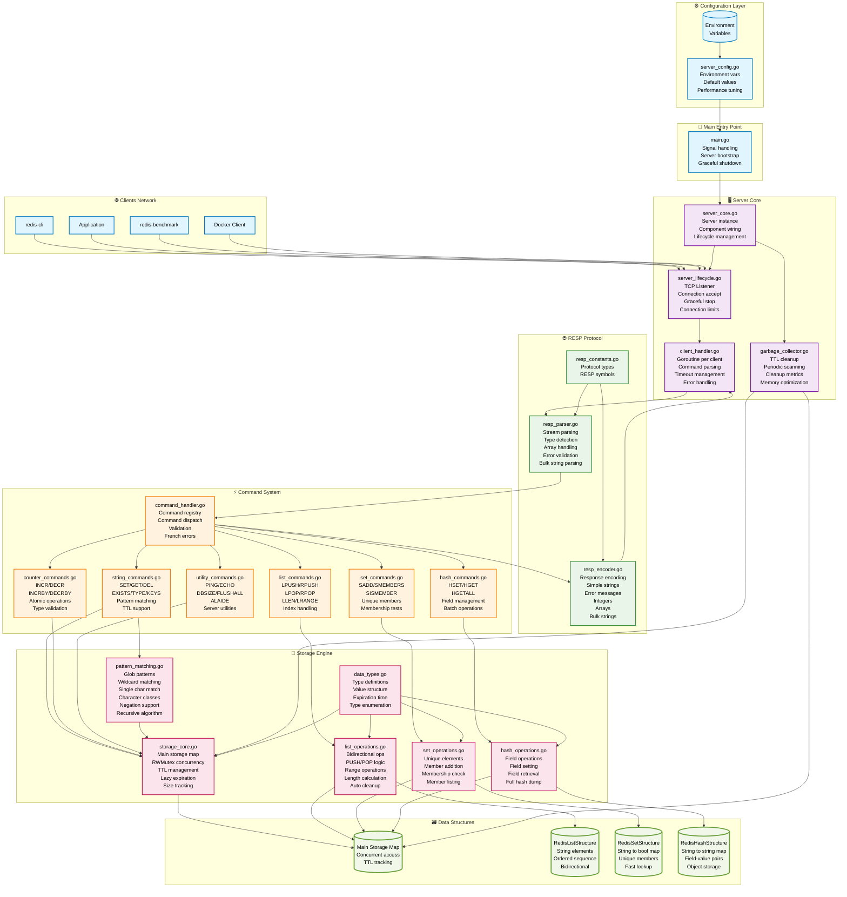

# 🚀 Redis-Go

> Implémentation complète de Redis en Go avec protocole RESP et types de données avancés

[](https://golang.org/)
[](https://docker.com/)
[](#)
[](#)

---

## 📋 Table des matières

- [✨ Fonctionnalités](#-fonctionnalités)
- [🚀 Démarrage rapide](#-démarrage-rapide)
- [🏗️ Architecture](#️-architecture)
- [📚 API des commandes](#-api-des-commandes)
- [⚙️ Configuration](#️-configuration)
- [🧪 Tests et exemples](#-tests-et-exemples)
- [🔧 Développement](#-développement)
- [📊 Performance](#-performance)

---

## ✨ Fonctionnalités

### 🎯 **Types de données supportés**
- **Strings** avec TTL et opérations atomiques (INCR/DECR)
- **Lists** bidirectionnelles avec PUSH/POP
- **Sets** pour collections uniques
- **Hashes** pour objets structurés

### 🌐 **Protocole réseau**
- **RESP complet** compatible Redis
- **TCP multi-client** avec gestion de concurrence
- **Pattern matching** avancé pour KEYS

### ⚡ **Performance**
- **~50K ops/sec** sur machine standard
- **Concurrence** optimisée avec RWMutex
- **Garbage collection** automatique des TTL
- **Memory footprint** minimal

### 🐳 **DevOps Ready**
- **Docker** avec build multi-stage
- **Docker Compose** pour environnement complet
- **Makefile** avec commandes intuitives
- **Variables d'environnement** pour configuration

---

## 🚀 Démarrage rapide

### Option 1: Docker (Recommandé)
```bash
# Clone et démarrage en une commande
git clone <repository-url> && cd redis-go
make run

# Dans un autre terminal
make cli
```

### Option 2: Go natif
```bash
# Prérequis: Go 1.24+
go mod tidy
go run main.go

# Test avec redis-cli
redis-cli -p 6379
```

### 🎮 Premier test
```bash
> SET welcome "Bienvenue sur Redis-Go!" EX 3600
OK
> GET welcome
"Bienvenue sur Redis-Go!"
> ALAIDE
# Affiche toutes les commandes disponibles
```

---

## 🏗️ Architecture

### 📁 Structure du projet
```
redis-go/
├── 🎯 main.go                     # Point d'entrée principal
├── 📦 internal/
│   ├── 🔧 config/                 # Configuration serveur
│   │   └── server_config.go
│   ├── 💾 storage/                # Moteur de stockage
│   │   ├── storage_core.go        # ├─ Core + concurrence
│   │   ├── data_types.go          # ├─ Définitions types
│   │   ├── list_operations.go     # ├─ Opérations listes
│   │   ├── set_operations.go      # ├─ Opérations sets
│   │   ├── hash_operations.go     # ├─ Opérations hashes  
│   │   └── pattern_matching.go    # └─ Pattern matching glob
│   ├── 🌐 protocol/               # Protocole RESP
│   │   ├── resp_constants.go      # ├─ Constantes RESP
│   │   ├── resp_parser.go         # ├─ Parser robuste
│   │   └── resp_encoder.go        # └─ Encoder optimisé
│   ├── ⚡ commands/               # Gestionnaire commandes
│   │   ├── command_handler.go     # ├─ Registry + dispatch
│   │   ├── string_commands.go     # ├─ SET/GET/DEL/EXISTS/KEYS
│   │   ├── counter_commands.go    # ├─ INCR/DECR/INCRBY/DECRBY
│   │   ├── list_commands.go       # ├─ LPUSH/RPUSH/LPOP/RPOP
│   │   ├── set_commands.go        # ├─ SADD/SMEMBERS/SISMEMBER
│   │   ├── hash_commands.go       # ├─ HSET/HGET/HGETALL
│   │   └── utility_commands.go    # └─ PING/ECHO/DBSIZE/ALAIDE
│   └── 🖥️ server/                 # Serveur TCP
│       ├── server_core.go         # ├─ Instance principale
│       ├── server_lifecycle.go    # ├─ Start/Stop gracieux
│       ├── client_handler.go      # ├─ Gestion clients
│       └── garbage_collector.go   # └─ Nettoyage TTL
├── 🐳 Dockerfile                  # Image optimisée
├── 🎼 compose.yaml               # Orchestration
├── ⚙️ Makefile                   # Commandes dev
└── 📚 README.md
```

### 🔄 Architecture complète



---

## 📚 API des commandes

### 🔤 Commandes String
| Commande | Syntaxe | Description |
|----------|---------|-------------|
| `SET` | `SET key value [EX seconds]` | 💾 Stocke avec TTL optionnel |
| `GET` | `GET key` | 🔍 Récupère une valeur |
| `DEL` | `DEL key [key ...]` | 🗑️ Supprime des clés |
| `EXISTS` | `EXISTS key [key ...]` | ✅ Vérifie l'existence |
| `TYPE` | `TYPE key` | 🏷️ Retourne le type |

### 🔢 Compteurs atomiques
| Commande | Syntaxe | Description |
|----------|---------|-------------|
| `INCR` | `INCR key` | ➕ Incrémente de 1 |
| `DECR` | `DECR key` | ➖ Décrémente de 1 |
| `INCRBY` | `INCRBY key increment` | ⬆️ Incrémente par N |
| `DECRBY` | `DECRBY key decrement` | ⬇️ Décrémente par N |

### 📝 Listes bidirectionnelles
| Commande | Syntaxe | Description |
|----------|---------|-------------|
| `LPUSH` | `LPUSH key element [element ...]` | ⬅️ Ajoute au début |
| `RPUSH` | `RPUSH key element [element ...]` | ➡️ Ajoute à la fin |
| `LPOP` | `LPOP key` | 🔙 Retire du début |
| `RPOP` | `RPOP key` | 🔚 Retire de la fin |
| `LLEN` | `LLEN key` | 📏 Longueur de liste |
| `LRANGE` | `LRANGE key start stop` | 📋 Sous-ensemble |

### 🎯 Sets (collections uniques)
| Commande | Syntaxe | Description |
|----------|---------|-------------|
| `SADD` | `SADD key member [member ...]` | ➕ Ajoute des membres |
| `SMEMBERS` | `SMEMBERS key` | 👥 Liste tous les membres |
| `SISMEMBER` | `SISMEMBER key member` | ❓ Test d'appartenance |

### 🗂️ Hashes (objets structurés)
| Commande | Syntaxe | Description |
|----------|---------|-------------|
| `HSET` | `HSET key field value [field value ...]` | 📝 Définit des champs |
| `HGET` | `HGET key field` | 🔍 Récupère un champ |
| `HGETALL` | `HGETALL key` | 📋 Tous les champs |

### 🔧 Utilitaires
| Commande | Syntaxe | Description |
|----------|---------|-------------|
| `KEYS` | `KEYS pattern` | 🔍 Recherche par motif |
| `PING` | `PING [message]` | 🏓 Test de connexion |
| `DBSIZE` | `DBSIZE` | 📊 Nombre de clés |
| `FLUSHALL` | `FLUSHALL` | 🧹 Vide la base |
| `ALAIDE` | `ALAIDE [commande]` | ❓ Aide interactive |

### 🎭 Pattern matching avancé
```bash
KEYS *              # Toutes les clés
KEYS user:*         # Clés d'utilisateurs  
KEYS temp:???:*     # Pattern avec longueur fixe
KEYS data:[a-z]*    # Intervalle de caractères
KEYS session:[^0-9]* # Négation de classe
```

---

## ⚙️ Configuration

### 🌍 Variables d'environnement
```bash
# Réseau
export REDIS_HOST=0.0.0.0          # Adresse d'écoute
export REDIS_PORT=6379              # Port du serveur

# Performance  
export REDIS_MAX_CONNECTIONS=1000   # Connexions simultanées

# Maintenance
export REDIS_EXPIRATION_CHECK_INTERVAL=1  # GC interval (secondes)
```

### 🐳 Configuration Docker
```yaml
# compose.yaml
services:
  redis-go:
    build: .
    ports:
      - "6379:6379"
    environment:
      - REDIS_MAX_CONNECTIONS=2000
    restart: unless-stopped
```

---

## 🧪 Tests et exemples

### 📝 Exemples d'utilisation

#### Gestion d'utilisateurs
```bash
# Profil utilisateur avec hash
HSET user:123 name "Alice" email "alice@example.com" age "30"
HGET user:123 name
# "Alice"

# Compteur de vues avec TTL
SET user:123:views 0
INCR user:123:views
INCRBY user:123:views 5
# 6
```

#### File de tâches
```bash
# Producteur
RPUSH tasks "send_email" "process_image" "backup_db"

# Consommateur  
LPOP tasks
# "send_email"
LLEN tasks
# 2
```

#### Cache avec expiration
```bash
# Cache 1 heure
SET cache:api_response '{"data": [...]}' EX 3600

# Vérification
GET cache:api_response
EXISTS cache:api_response
```

### 🧪 Tests automatisés
```bash
# Tests unitaires
make test

# Tests d'intégration Docker
make test-auto

# Tests de performance
redis-benchmark -h localhost -p 6379 -q -n 100000
```

---

## 🔧 Développement

### 🛠️ Commandes Make
```bash
# 🚀 Serveur
make run          # Démarre Redis-Go
make restart      # Redémarre complètement  
make down         # Arrête tout
make logs         # Affiche les logs live

# 🔧 Développement
make build        # Compile le binaire
make test         # Lance les tests
make fmt          # Formate le code Go
make deps         # Met à jour go.mod

# 🎮 Utilisation
make cli          # Redis-cli interactif
make status       # État des services
make help         # Aide complète
```

### 📝 Ajouter une nouvelle commande

1. **Définir la méthode storage** (si nécessaire)
```go
// internal/storage/storage_core.go
func (rs *RedisInMemoryStorage) NewOperation(key string) result {
    // Implémentation
}
```

2. **Créer le handler de commande**
```go
// internal/commands/my_commands.go  
func (r *RedisCommandRegistry) handleMyCommand(args []string, store *storage.RedisInMemoryStorage, encoder *protocol.RedisSerializationProtocolEncoder) error {
    // Validation des arguments
    // Appel du storage
    // Encodage de la réponse
}
```

3. **Enregistrer dans le registry**
```go
// internal/commands/command_handler.go
r.registeredCommands["MYCOMMAND"] = r.handleMyCommand
```

### 🏗️ Choix d'architecture

**🔒 Concurrence**: RWMutex global pour simplicité et performance des lectures parallèles

**💾 Stockage**: Structure Value unifiée avec types et TTL, évite la fragmentation

**🌐 Protocole**: Parser streaming robuste, gère les connexions instables

**🔧 Pattern**: Registry pour extensibilité, messages d'erreur en français

---

## 📊 Performance

### 📈 Métriques typiques
- **Throughput**: ~50K ops/sec (machine standard)
- **Latency**: <1ms pour GET/SET simple
- **Memory**: ~100 bytes overhead par clé
- **Connexions**: 1000 clients simultanés par défaut

### ⚡ Optimisations appliquées
- ✅ **Lectures parallèles** avec RWMutex
- ✅ **Pas de sérialisation** - données natives
- ✅ **Pattern matching** algorithmique optimisé
- ✅ **GC intelligent** lazy + actif
- ✅ **Parser RESP** sans copies inutiles

### 🔬 Benchmarks
```bash
# Test de charge basique
redis-benchmark -h localhost -p 6379 -n 100000 -c 50 -q

# Tests spécifiques par type
redis-benchmark -h localhost -p 6379 -t set,get -n 50000 -q
redis-benchmark -h localhost -p 6379 -t lpush,lpop -n 50000 -q
```

---

## 🚧 Roadmap

### 🎯 Prochaines fonctionnalités
- [ ] **Persistence**: RDB snapshots + AOF logs
- [ ] **Pub/Sub**: PUBLISH/SUBSCRIBE en temps réel
- [ ] **Transactions**: MULTI/EXEC/WATCH
- [ ] **Sorted Sets**: ZADD/ZRANGE avec scores
- [ ] **Lua scripting**: Sandbox sécurisé
- [ ] **Authentification**: Users et permissions

### 📊 Améliorations performance
- [ ] **Index TTL**: Priority queue pour expiration
- [ ] **Métriques**: Prometheus/metrics endpoints
- [ ] **Slow log**: Monitoring des requêtes lentes
- [ ] **Clustering**: Distribution horizontale

---

## 🤝 Contribution

Les contributions sont les bienvenues ! Quelques guidelines :

1. **Fork** le projet
2. **Créer** une branche feature (`git checkout -b feature/amazing-feature`)
3. **Commit** vos changements (`git commit -m 'Add amazing feature'`)
4. **Push** vers la branche (`git push origin feature/amazing-feature`)
5. **Ouvrir** une Pull Request

### 📋 TODO pour les contributeurs
- [ ] Tests de charge avec Grafana
- [ ] Support Windows natif
- [ ] Documentation API OpenAPI
- [ ] Helm chart Kubernetes
- [ ] CI/CD GitHub Actions

---

## 📄 License

Distribué sous licence MIT. Voir `LICENSE` pour plus d'informations.

---

## 🙏 Remerciements

- **Redis Team** pour le design original et la spécification RESP
- **Go Community** pour l'écosystème et les outils
- **Docker** pour la containerisation moderne

---

<div align="center">

**⭐ Si ce projet vous a aidé, n'hésitez pas à lui donner une étoile !**

Made with ❤️ and ☕ by [Your Name]

</div>